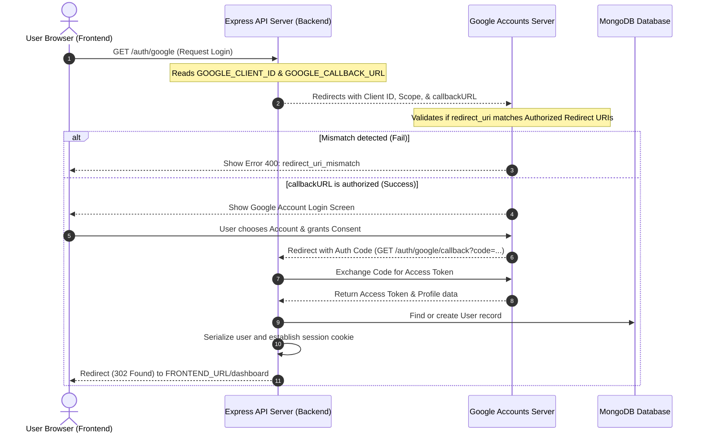

# Refine AI - Google OAuth Diagnostic Report

This report documents the Google OAuth authentication flow audit and provides the exact settings required in the Google Cloud Console to resolve the `redirect_uri_mismatch` error.

---

## 1. Authentication Flow Diagram

The diagram below details the sequence of requests between the browser (frontend), the local API server (backend), and Google's OAuth endpoints.



---

## 2. OAuth Configuration Audit & Settings

Based on the audit of the `Refine-AI-Hackwave-main` repository, here are the configurations extracted from your environment:

### A. Current Configuration Details
* **Frontend Local URL:** `http://localhost:5173`
* **Backend Local URL:** `http://localhost:3000`
* **GOOGLE_CLIENT_ID:** `634223186175-q53klqoehg440vocg2ke9ksp41uh0i3j.apps.googleusercontent.com`
* **Current redirect_uri sent to Google:** `http://localhost:3000/auth/google/callback`

---

## 3. Required Google Cloud OAuth Settings

To allow successful sign-ins, you must register these exact parameters in your Google Cloud Console project settings for the client ID `634223186175-q53klqoehg440vocg2ke9ksp41uh0i3j.apps.googleusercontent.com`:

### Required Configurations:

| Parameter | Recommended Value | Alternative (if testing with IP) |
| :--- | :--- | :--- |
| **Authorized JavaScript Origins** | `http://localhost:5173` | `http://127.0.0.1:5173` |
| **Authorized Redirect URIs** | `http://localhost:3000/auth/google/callback` | `http://127.0.0.1:3000/auth/google/callback` |

---

## 4. Code Locations & Files

The following files contain the configuration and strategy setup for the Google OAuth flow:

1. **[backend/.env](file:///c:/Users/sanvi/Downloads/Refine-AI-Hackwave-main/Refine-AI-Hackwave-main/backend/.env)**:
   - Holds the environment variables:
     - `GOOGLE_CLIENT_ID`
     - `GOOGLE_CLIENT_SECRET`
     - `GOOGLE_CALLBACK_URL`
     - `FRONTEND_URL`
     - `BACKEND_URL`
2. **[backend/server.js](file:///c:/Users/sanvi/Downloads/Refine-AI-Hackwave-main/Refine-AI-Hackwave-main/backend/server.js)**:
   - Initializes Passport Google Strategy (using `GOOGLE_CLIENT_ID` and `GOOGLE_CALLBACK_URL`).
   - Defines the `/auth/google` and `/auth/google/callback` endpoints.
   - Sets the dynamic CORS policy mapping origin dynamically from `FRONTEND_URL`.
3. **[src/pages/Signup.jsx](file:///c:/Users/sanvi/Downloads/Refine-AI-Hackwave-main/Refine-AI-Hackwave-main/src/pages/Signup.jsx)**:
   - Contains the frontend sign-in button click handler redirecting the browser window to `${import.meta.env.VITE_API_URL}/auth/google`.

---

## 5. Exact Fix for `redirect_uri_mismatch`

Since the client ID belongs to your Google Account Developer Console, follow these steps to register your local URLs:

1. Go to the [Google Cloud Console Credentials Screen](https://console.cloud.google.com/apis/credentials).
2. Select your project **Refine AI** (or the corresponding project name).
3. Click on the edit pencil icon next to your OAuth 2.0 client: `634223186175-q53klqoehg440vocg2ke9ksp41uh0i3j.apps.googleusercontent.com`.
4. In the **Authorized JavaScript origins** section, click **ADD URI** and enter:
   ```text
   http://localhost:5173
   ```
5. In the **Authorized redirect URIs** section, click **ADD URI** and enter:
   ```text
   http://localhost:3000/auth/google/callback
   ```
6. Click **Save** at the bottom of the page.
7. Wait **1 to 2 minutes** for Google's servers to sync, clear your browser cookies/cache, and sign in again.
